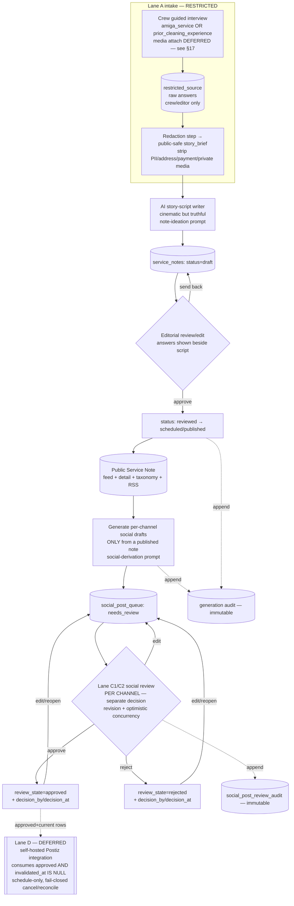

# Service Notes — system specification (GH-1442 Phase 2)

**Status:** Lane B is shipped. Lane C1 backend review authority is **MERGED** (GH-1491/TASK-3CF55E,
squash `913895c5`, PR #1492, 2026-07-15; issue closed, shared migration applied). Lane C2 (direct-app
review UI) is **implemented and under exact-head review (repair round in progress)** under GH-1493/TASK-56A85C. Lane D delivery remains
deferred. This is a system spec, **not** a `/design` mockup; C1 added no `design/**`, UI, scheduling,
provider call, delivery, or publication side effect.

Grounded in cold-read mapping of the current Amiga app and the Pixexid `admin-social-queue` reference
(the latter informs the downstream delivery lanes only).

> **⛔ LANE C SPLIT + DOWNSTREAM RE-PROVIDER (2026-07-15) — supersedes the Lane C/D flow below where they conflict.**
> Lane C is now split into **C1** (backend/shared-DB review authority — GH-1491 / TASK-3CF55E, **MERGED** squash `913895c5`, PR #1492, 2026-07-15) and **C2** (direct-app review UI — **implemented and under exact-head review (repair round in progress)**, GH-1493/TASK-56A85C). The C1 frozen lifecycle in GH-1491 is the authority for social review and overrides §7 and the §6.x/diagram social-review nodes:
> - Review states are the closed set `needs_review` / `approved` / `rejected`. Transitions: `approve` (needs_review→approved), `reject` (needs_review→rejected), `reopen` ({approved,rejected}→needs_review), `edit` (any→needs_review, always demotes). Per-row default plus one atomic all-or-none three-channel `approve-set`.
> - **C1 approval is review authority only. It does NOT set `scheduled_at`, does not schedule, and calls no delivery provider.** Scheduling/dispatch belong to the deferred downstream lane. Editable copy is allowlisted to `post_text`/`hashtags`/`image_brief`; all provenance/disclosure/price/URL/channel/lineage fields stay server-owned; edits re-run the shared copy-safety screens and append an immutable review-audit event; source correction/supersession wins races via `invalidated_at is null` + fingerprint currency under row lock.
> - **Downstream delivery (§8, "Radaar") is re-providered to self-hosted Postiz** (https://github.com/gitroomhq/postiz-app + Postiz Agent), replacing Radaar. Boundary frozen by Codex 2026-07-15: **C1/C2 stay Amiga's sole review/approve authority** (Postiz's Public API has draft/schedule/now but no approval-audit/idempotency/invalidation/optimistic-concurrency contract). Deferred **Lane D = a Postiz integration** consuming only current Amiga-approved rows (`approved` AND `invalidated_at is null`), mapping project/channel→Postiz org/group/integration, creating scheduled posts only after explicit Amiga authorization (or a Postiz-draft-only explicit handoff), persisting Postiz postId/integration/status, with fail-closed invalidation/cancel/reconciliation. Amiga retains content safety, approval, no-send/kill switch, invalidation, and delivery attempt/audit; postiz-agent/CLI/MCP never bypasses Amiga approval. Every "Radaar" reference in §4/§7/§8 and the delivery diagram node is stale/non-authoritative. No Lane D implementation or Postiz call is authorized; no-send / no-publication gates remain in force.

---

## 1. Product principles

1. **Service Notes are the primary public product** — a continuously updated, status-page-like diary /
   micro-blog about the daily life of a house-cleaning business. Worth following even without a search
   engine: useful, interesting, sometimes respectfully funny, always tied truthfully to cleaning work.
2. **Deliberately authored public editorial artifacts** — not private customer/job notes, not an
   SEO-automation feed. Audiences: potential + existing clients, other cleaners/operators, search
   visitors.
3. **Trust bridge for a new company.** Amiga is new, but the crew is experienced. When a customer can't
   yet find many reviews/referrals, genuine stories + practical knowledge demonstrate how the crew
   thinks, works, and cares for a home. Editorial evidence **complements** reviews and must **never**
   masquerade as a testimonial, customer endorsement, or independently verified reputation signal, and
   must never publish an unsourced credibility claim (years, customer count, rating/stars).
4. **Two source types, one interview.** A note is sourced from a short guided crew interview about
   either (a) `amiga_service` — a real service Amiga performed, tied to a run/booking; or (b)
   `prior_cleaning_experience` — a genuine remembered story from the crew's cleaning years before Amiga
   existed.
5. **Truthful storytelling.** AI may make a note read cinematically (structure, pacing, scene-setting,
   voice, metaphor, humor) but must never turn invented customer facts, actions, outcomes, quotes,
   locations, or services into apparent fact. Approximate memory is omitted or framed honestly, never
   fabricated.
6. **Separation of decisions.** Three independent human decisions, never collapsed: (i) submitting a
   crew interview, (ii) publishing a Service Note, (iii) approving each channel's social derivative.
   None implies the next.
7. **Fail closed.** Unknown state, missing authority, unresolved consent, or an unrecognized channel
   never produces a public or external side effect.

---

## 2. Actors & permissions

| Actor | Can | Cannot |
|---|---|---|
| **Crew** | Submit a guided interview for `amiga_service` or `prior_cleaning_experience`; view their own submissions. (Media attachment is deferred — see §17; no attach affordance in initial A2) | See other crew's raw submissions; edit an editorial draft; publish; touch the social review queue or downstream delivery |
| **Editor/Operator** | Read restricted submissions; author/revise the public-safe brief (editor-manual redaction); generate & edit the AI story draft; move a note through the editorial lifecycle; publish; correct/archive; review/edit/approve/reject/reopen social drafts per channel (Lane C1/C2 authority) | Bypass consent gates; publish a note whose consent/redaction is incomplete; auto-publish; edit server-owned social fields (channel, price/URL/narrative/disclosure, lineage) |
| **System worker** (server) | Run AI story-script generation (from an approved public-safe brief) and social-draft generation; append audit events. Downstream delivery is the deferred Lane D Postiz integration and consumes only already-approved rows | Redact/author the brief (editor-manual); advance a note to `published`; approve a social draft; post an unapproved/unknown-state row; deliver from C1 (C1 has no delivery side effect) |
| **Public visitor** | Read only `published` Service Notes (feed, detail, taxonomy, RSS) | See drafts, restricted sources, raw crew answers, or any non-published row |

RLS enforces this: restricted-source tables are crew/editor/service-role only; `service_notes` are
publicly readable **only** where `status='published'`; social/queue tables are editor/service-role only.

---

## 3. End-to-end flow

C1 stops at review authority: `approve`/`reject` set `decision_by_profile_id`+`decision_at`; `edit` (always demotes) and `reopen` return a row to `needs_review`. There is no `scheduled_at`, no `sent`/`failed` state, and no provider call in C1 — scheduling/dispatch and delivery states belong to the deferred Lane D Postiz integration.

### Prose walkthrough

1. **Crew interview (RESTRICTED).** A crew member answers ~5–7 plain questions right after a service,
   or recalls a pre-Amiga story. Raw answers land in a restricted-source store visible only to
   crew/editor/service-role. **Submitting does not publish anything.** (Media attachment is deferred to a
   separate accepted media-pipeline lane — see §17; the initial A2 questionnaire has no attach control.)
2. **Redaction → story brief.** Before any AI call, an editor produces a durable, versioned public-safe
   `story_brief` (its own entity — see §6): strip customer identity, address/access, payment, and
   private/unconsented media; record `source_type`, the source reference (`source_booking_id` and/or
   `source_route_run_id` for `amiga_service`; both null for `prior_cleaning_experience`),
   `source_provenance`, approved media IDs, `source_fingerprint`, and `consent_ref`. The AI consumes
   **only a current, approved brief**; changing the underlying restricted answers or consent invalidates
   the brief and any downstream draft (§8).
3. **AI story-script.** The note-ideation prompt turns the redacted brief into a cinematic-but-truthful
   Service Note draft (`status=draft`). It never invents customer facts/actions/outcomes/quotes/
   locations/services; approximate memory is omitted or honestly framed. For `prior_cleaning_experience`
   it uses the "our years working in cleaning" framing and never implies Amiga performed the old job.
4. **Editorial review/edit.** The editor sees the redacted answers **beside** the generated script,
   edits freely, and advances `draft → reviewed → scheduled` (future publish time) **or** `published`.
   Publishing is a distinct human decision.
5. **Public Service Note.** A published note appears in the public feed, at its stable
   `/service-notes/{slug}` URL, in taxonomy browsing, and in the RSS feed.
6. **Social drafts (downstream, optional).** From a **published** note only, the social-derivation
   prompt produces per-channel drafts into `social_post_queue` (`needs_review`). This is separate from
   note publication and can be skipped entirely.
7. **Social review/approval (Lane C1 authority; C2 is its direct-app UI).** The editor reviews/edits and
   approves or rejects **per channel** (separate decision), or approves all three atomically. The closed
   lifecycle is `needs_review`/`approved`/`rejected`: `approve`/`reject` set `decision_by_profile_id`+
   `decision_at`; `edit` always demotes to `needs_review`; `reopen` clears a decision back to
   `needs_review`. Mutations are database-authoritative atomic RPCs with a `revision` optimistic lock,
   request-bound idempotency, and an immutable `social_post_review_audit`. Edited copy re-runs the full
   Lane B final-draft validator (price equality, channel profile, disclosure in postText **and**
   imageBrief, PII/secret/address rails). Approval sets **no** `scheduled_at` and triggers no delivery —
   C1 ends at review authority.
   **The review panel can generate social drafts, on server authority (GH-1516, 2026-07-17).**
   C2 remains a pure consumer of C1 *review* authority — it adds no schema, no approval authority,
   and no delivery/Postiz call — but it is no longer review-only: a published note's social panel
   offers a **Generate drafts** control, and it does so **if and only if the server says a run is
   safe to start**. The retired copy "Drafts aren't generated from this screen" is gone; it was true
   only while no shipped surface could generate, and it died in the same change that restored the
   control.
   The affordance was originally built, then **deliberately split out**, because the server contract
   could not prove settlement to a client (one 409 meaning both "our run" and "a competing run"). It
   returns now because GH-1515 fixed that at the source rather than papering over it in the client.
   Authenticated admins read
   `GET /api/operations/service-notes/social/generate?sourceNoteId=<uuid>`, which returns only
   `sourceNoteId`, `safeToStart`, and either no operation or `{id,status}`. The bounded status vocabulary
   is `claimed | running | succeeded | failed | blocked | lease_expired | provider_outcome_unknown`;
   provider, failure, lease-owner,
   token, model, and internal audit details are never returned. PostgreSQL derives the row and
   `safeToStart` together from current note/operation authority. Active work always fails closed;
   terminal/pre-provider-expired work is startable only when the source is currently publishable;
   provider-started expiry returns `provider_outcome_unknown` and fails closed until explicit recovery
   settles the original operation; a succeeded set
   is startable again only after its source fingerprint is no longer current. The existing POST remains
   the mutation/idempotency authority and still resolves races.
   **The UI rule:** `safeToStart` **alone** decides whether a NEW generation run may be STARTED — that
   is what the **Generate drafts** control is gated on, and `status` selects the wording and never
   participates in that decision. There is exactly one action offered while `safeToStart:false`, and it
   is a settlement, not a start: when the server reports `provider_outcome_unknown` for an operation
   whose id equals the idempotency key this session still holds, the panel offers **"Recover last run"**
   — an exact-key replay that settles that original operation (the key IS the operation id) without
   starting or paying for a second run. It is scoped to `provider_outcome_unknown`; `claimed`/`running`
   are a live run under way and stay withheld as "run is under way." Nothing else settles
   `provider_outcome_unknown` — there is no sweeper or cron over the operations table — so if the
   session does not hold the matching key, the panel withholds every control and says plainly that
   recovery needs the original request or a backend fix; it never promises an automatic recovery, which
   would strand the note forever. An unrecognised future status degrades to generic copy with the gate
   unchanged; an authority that cannot be read withholds the control entirely rather than guessing.
   `safeToStart:true` on `succeeded` means the source rotated, so the copy states plainly that
   generating **replaces** the current reviewed set and its decisions. Generation writes drafts for
   review only — nothing is scheduled, published, or sent.
   **The generation idempotency-key lifecycle is settlement-evidence, not HTTP-status.** The key IS the
   operation id, so it is retained while its operation may still be unsettled and rotated only when the
   answer PROVES settlement. An unknown transport outcome retains; a **same-key in-progress 409** and a
   **pre-claim 429** retain too, because neither proves the original operation settled (the rate limit
   is checked before the body is even parsed); every other deterministic answer rotates. A retained key
   is reused for a NEW authorised start only until authority reports that exact operation terminally
   settled (`succeeded | failed | blocked`) — then a fresh key is minted so the new start is not a
   replay of a settled run. Pre-provider `lease_expired` is reclaimable under the same key.
   **Fail-closed on a terminal 403 (C2 UI).** The review GET stays readable for any operational
   account, but a refused mutation (**403** from `requireOperationalWriter` — an account without write
   access) fails the panel closed: all mutation controls and edit fields disable, the drafts stay
   readable, and it surfaces *"Your account can't make changes here. These drafts are read-only for
   you."* The lock is bound to the refused authority — it survives a panel close/reopen and a plain
   refetch, and releases only when the acting authority changes. Retrying with the same authority would
   be refused again, so the panel never re-offers the action. (View-as was removed in the GH-1518
   sunset; there is no `impersonation_read_only` cause and no in-app recovery to route to — a 403 has
   one meaning here.) Per F2, a
   transport-ambiguity idempotency key is retained per target and rotated on any copy/payload change,
   cancel, or deterministic result — never reused across changed copy.
8. **Downstream delivery — DEFERRED Lane D (self-hosted Postiz integration).** Not built yet. When built,
   a Postiz integration consumes only current, approved rows (`review_state='approved' AND invalidated_at
   IS NULL`), maps channel→Postiz integration, submits schedule-only (never immediate) after explicit
   Amiga authorization, persists Postiz postId/status, and owns retries/reconciliation plus a kill switch
   that demotes/cancels already-queued Postiz posts. Amiga retains content safety, approval, invalidation,
   and delivery-attempt audit. `sent`/`failed` are Lane D delivery states, not C1 review states.

**Historical (`prior_cleaning_experience`) path** diverges only at intake: it is **not** tied to an
Amiga service (`source_booking_id` and `source_route_run_id` both null), it adds memory-specific
questions (confident vs uncertain, useful
lesson, owned/consented old media), and its published copy carries the "our years working in cleaning"
byline. From the story brief onward it uses the identical pipeline.

---

## 4. Direct-app screen & interaction inventory (no visual mockups)

| Screen | Primary actor | Purpose / key actions |
|---|---|---|
| **Crew questionnaire** | Crew | Mobile-first guided form; pick source type; for `amiga_service` pick an eligible linked job from own assignee-scoped work (booking-backed first, otherwise route-run-backed; no raw UUID and no rendered IDs); answer 5–7 questions; submit (→ restricted). **No media attach in initial A2 (deferred — §17).** |
| **Restricted submission list/detail** | Editor | Review raw submissions; author/revise the public-safe brief (editor-manual redaction) and post it to the briefs endpoint. |
| **Editorial draft/review** | Editor | Redacted answers shown **beside** the AI script; edit; **select/confirm `narrative_mode`** and, for `fictionalized_or_composite`, review + approve the required `disclosure_text`; advance lifecycle; correction/archive. |
| **Scheduled/published notes** | Editor | See scheduled (future) + published notes; correct/archive (no `unpublish`). |
| **Public feed** | Public | Newest-first list; service/topic/location filters. |
| **Public note detail** | Public | One note at `/service-notes/{slug}`; related service/booking links; byline/disclosure. |
| **Public taxonomy** | Public | Browse by service / topic / city. |
| **Public RSS** | Public/feed readers | Feed of published notes (in launch scope). |
| **Social draft review** | Editor | Per-note channel drafts; edit; per-channel approve/reject; "approve all for note". |
| **Delivery/audit status** | Editor | C1 exposes per-channel review state (`needs_review`/`approved`/`rejected`) + decision actor/time + `revision` + review audit. `scheduled`/`sending`/`sent`/`failed` and the kill switch belong to the deferred Lane D delivery view, not C1. |

Role visibility: crew see only the questionnaire + their own submissions; editor/operator see all
editorial + social + delivery screens; the public sees only published notes/feed/detail/taxonomy/RSS;
the system worker has no UI.

---

## 5. State machines

Each machine lists: states, `transition (actor, guard → side effect)`. **Any unknown state or missing
authority fails closed** (no publish, no post).

### 5.1 Crew intake / restricted source
States: `submitted → redacted → brief_ready` · `discarded`.
- `submit` (crew; required questions answered → writes restricted row, audit).
- `redact` (editor; row exists → produces `story_brief`, strips PII/unconsented media, audit).
- `discard` (editor; any → `discarded`, retained for audit, never public).

### 5.2 Service Note editorial lifecycle
States: `draft → reviewed → scheduled → published → corrected` · `archived`.
- `set_narrative_mode` (crew/editor; any pre-publish state → same state). Mode selection/change
  **creates or approves a NEW current `story_brief` version carrying the selected mode**, and
  **invalidates the prior brief version, the current note draft, and any downstream social drafts**
  (regen required). It **never mutates an approved brief in place.** Generation consumes only the
  current approved brief version. AI may never change the mode; unknown/missing mode fails closed (§10.1).
- `generate_draft` (system; `brief_ready` + a known `narrative_mode` → `draft` via note-ideation prompt
  bounded by that mode, audit; missing/unknown mode fails closed — no generation).
- `edit` (editor; edits the draft content). A `draft` edit stays `draft`. A `reviewed` edit **demotes to
  `draft`** and requires a fresh `mark_reviewed` (content never stays `reviewed` after an edit).
  `scheduled`/`published` edits are **rejected** (published content changes via `correct`). Audits the exact
  changed fields + actor.
- `mark_reviewed` (editor; `draft` → `reviewed`).
- `schedule` (editor; `reviewed` + future `published_at` → `scheduled`).
- `publish` (editor, OR system when a `scheduled` note's time arrives; `reviewed|scheduled` →
  `published`, sets `published_at`, audit). **Public read starts here.** **Guard:** a
  `fictionalized_or_composite` note requires explicit editor approval of its `disclosure_text` (non-null)
  before it can reach `reviewed`/`published`; missing disclosure fails closed.
- `correct` (editor; `published` → `corrected` then back to `published` with `corrected_at` +
  `correction_history` appended; never silently rewrites history).
- `archive` (editor; any → `archived`, removed from public feed). **Conditional URL policy (resolved):**
  (a) archived for safety/privacy/legal removal → **410 + noindex** and immediate media revocation;
  (b) superseded/merged into a reviewed replacement → **301** to that replacement; (c) ordinary
  archival with no replacement → a minimal **noindex tombstone** (never an unrelated redirect). The
  chosen disposition is recorded in `correction_history`/audit.

### 5.3 Media consent
States: `none → pending → consented` · `rejected`.
- A `kind:real` media asset cannot attach to a published note without `consent_ref` in `consented`.
  Unconsented/`pending`/`rejected` media is never published (fail closed).

### 5.4 Social draft review (per channel) — C1 closed lifecycle
States: `needs_review` / `approved` / `rejected`. C1 is Amiga's sole review/approve authority; it ends
here — no `scheduled_at`, no delivery states, no provider call.
- `generate` (system; **only** from a `published` note → `needs_review` rows, one per channel, audit).
- `edit` (editor; any state → `needs_review`; always demotes, clears `decision_by_profile_id`/`decision_at`).
- `approve` (editor; `needs_review` → `approved`; sets server-owned `decision_by_profile_id` + `decision_at`).
- `reject` (editor; `needs_review` → `rejected`; sets server-owned `decision_by_profile_id` + `decision_at`).
- `reopen` (editor; `approved`/`rejected` → `needs_review`; clears `decision_by_profile_id`/`decision_at`).
- `approve_set` (editor; one atomic all-or-none approve across the note's current three channels, per-row
  default).
- Mutations are DB-authoritative atomic RPCs guarded by a `revision` optimistic lock + request-bound
  idempotency; every transition appends to the immutable `social_post_review_audit`.

### 5.5 Downstream delivery (deferred Lane D — Postiz integration)
**Not built.** C1 approval sets no `scheduled_at`, triggers no delivery, and makes no provider call.
`sent`/`failed`/`scheduled`/`sending` are Lane D delivery states layered on top of a C1-`approved` row,
not C1 review states. When Lane D is built it will consume only current approved rows
(`review_state='approved' AND invalidated_at IS NULL`), map channel → Postiz integration
(https://github.com/gitroomhq/postiz-app), and submit **schedule-only** (never immediate) requests to
Postiz after explicit Amiga authorization, persisting the returned Postiz `postId`/status. Lane D owns
retries/reconciliation (Postiz has no idempotency-key/result-webhook contract, so Lane D owns uniqueness
+ polling/reconcile) and a kill switch that also demotes/cancels already-queued Postiz posts. One Postiz
org + API key per project. No Lane D implementation or Postiz call is authorized now.

---

## 6. Data & entity boundaries (restricted vs public)

| Entity | Boundary | Notes |
|---|---|---|
| `service_note_source` (raw crew answers + media refs) | **RESTRICTED** (crew/editor/service-role) | `source_type`; **`source_booking_id` uuid null + `source_route_run_id` uuid null** (typed Amiga service refs); answers, media refs, consent state, revision counter. Never public. **Invariant (fail closed):** `amiga_service` requires ≥1 of the two refs; `prior_cleaning_experience` requires **both null**. |
| `story_brief` (durable redacted brief) | **RESTRICTED** (editor/service-role) | The only thing the AI consumes. `id`, `source_id` FK, `version` int, `status` (`draft`/`approved`/`invalidated`), **`narrative_mode`** (`field_report`/`narrated_story`/`fictionalized_or_composite`; crew/editor-selected, default `narrated_story`), `redacted_by`, `redacted_at`, `source_fingerprint` (hash of the source revision it was built from), `approved_media_ids[]`, brief text. **Invalidation (version-based, never in-place):** a change to the source answers, consent, **or `narrative_mode`** produces a **new current brief version** and marks the prior version `invalidated`; the note draft + downstream social drafts built from the prior version are flagged for regen. Generation consumes only the current approved version (§8, §10.1). |
| `service_notes` (editorial artifact) | Public **only where `status='published'`** | Lifecycle fields; `slug` (stable), headline, excerpt, body, `service_type`, `topic[]`, `city/city_slug` (nullable), intended_audience, takeaway, tone_humor, `source_type`, **`narrative_mode`** + `disclosure_text` (required non-null when `fictionalized_or_composite`), `story_brief_id` + `story_brief_version` (the exact brief consumed), `source_provenance`, `consent_ref`, author, editor, related_service_page, scheduled_at, published_at, corrected_at, `correction_history`. |
| `service_note_media` | Public only if `kind:real` + `consented` + attached to a published note | Stored in a **private** Supabase Storage bucket (§11); generated/template media labeled as such; real media requires consent + signed access. |
| `generation_audit` (AI runs) | Append-only, editor/service-role read | Per note-write AND per social-derivation call: `prompt_version`, `model`, **`narrative_mode`**, `brief_version` + `source_fingerprint`, `generated_by`, `generated_at`, token/cost or provider usage, `result_status`, and `regeneration_lineage` (supersedes chain). For Service Note writes, the database derives each supersedes edge from the latest audit for the same source across all brief versions; client lineage input is never authoritative. |
| `social_post_queue` | Editor/service-role only | Current per-channel draft and C1 review state/revision/decision provenance; FK → published `service_notes`. It contains no Lane D provider or delivery state. |
| `social_post_review_operation` | Editor read through admin RLS; RPC-write only | One immutable parent per globally unique review `idempotency_key`, with canonical request fingerprint, ordered targets/revisions, and bounded recorded outcome. |
| `social_post_review_audit` | Editor read through admin RLS; RPC-write only | Immutable per-row transition children. One ordinary operation owns one child; one `approve_set` owns exactly three. Stores changed field names, not full copy. |
| `*_audit` (source, note, social, generation) | Append-only, editor/service-role read | Immutable event log for every material transition. |

Amiga conventions to follow (from cold-read of current `main`): migrations in `db/migrations/`
(`YYYYMMDD_*.sql`, revoke-all → grant-specific → `security definer` RPC `set search_path=public,pg_temp`
→ enable RLS, per `20260619_add_messaging_schema.sql`); shared Supabase is the acceptance DB (project
ref `wbqjeasgxakubqcutgjt`). Seed-migrate the 13 existing static notes in `src/data/service-notes.ts`
as `published` rows (they are already `privacyLevel:"public-safe"`); their existing `/service-notes#slug`
fragment links keep working via the **client-side** anchor migration to the new per-note routes (see §12).

### A1 implementation contract (GH-1464)

The repository implementation uses plural SQL table names:
`service_note_sources`, `service_note_story_briefs`, `service_notes`, `service_note_media`,
`service_note_generation_audit`, `service_note_generation_budget_reservations`, and
`service_note_generation_operations`, and `service_note_audit_events`. The server derives `source_fingerprint` inside the version-replacement
RPC from the locked source revision, answers, consent reference, selected narrative mode, and sorted
approved-media IDs; callers do not supply a trusted fingerprint. Concurrent provider calls reserve
a conservative upper bound (UTF-8 prompt/input bytes plus maximum output tokens) atomically before
the external request, and reservations expire after 15
minutes if a worker dies. Brief replacement and generation commit both lock source then brief and
re-check the exact current approved version, preventing a stale generation from committing after
consent/source invalidation. Seeded legacy rows carry an owned seed key, version, and payload
fingerprint: reruns preserve later editorial changes but fail explicitly on conflicting ownership.
Generation commit then locks every approved-media row in deterministic UUID order and revalidates its
source, derivative approval, scan result, consent, revocation state, and narrative-mode eligibility;
the same transaction attaches every approved row to the new note so later archive/invalidation cleanup
cannot orphan consented derivatives. Media ownership is single-note and first-claim-wins: attachment
updates only unowned rows, and a second or concurrent generation from the same brief fails atomically
rather than stealing media from the first note.
Generation success and failure settlement use the same source → brief → operation lock/re-check order.
After the source lock serializes same-source writers, the database selects the prior Service Note audit
for that source by `generated_at DESC, id DESC`, ignores the compatibility-only client supersedes
parameter, and assigns a timestamp strictly later than the selected prior audit. This produces one
source-wide chain across brief replacements, successes, failures, and blocks without cross-source
edges or equal-timestamp latest-row ambiguity.
Replacing a brief marks every derived note stale, but an already archived note retains its existing
`archived` status, `archive_disposition`, and redirect `replacement_note_id`; invalidation cannot
silently rewrite an established redirect/tombstone/gone decision back to draft. Every approved media
attachment on an invalidated note is revoked in that same transaction and therefore enqueued in the
durable cleanup outbox, including attachments on draft, reviewed, scheduled, or archived notes. The
forward repair also backfills already-stale attached media from invalidations that predate the trigger.

Backend contracts introduced by A1 are:

- `POST /api/service-notes/sources` — authenticated staff/admin intake; typed booking/run linkage is
  checked again in the RPC, and task-based staff access requires an explicit `assignee` assignment
  (an `observer` assignment is insufficient).
- `POST /api/operations/service-notes/briefs` — admin-only redaction/approval and immutable version
  replacement.
- `POST /api/operations/service-notes/generate` — admin-only, cap-reserved story generation; requires
  a stable UUID `idempotencyKey`. The database operation record and provider request share that key,
  so a committed success is returned on retry without another paid call. A five-minute, single-owner
  lease distinguishes a live request from an interrupted one; heartbeats extend only a live owner,
  while an expired pre-provider operation may be reclaimed only under the same idempotency key. Once
  a paid provider attempt starts, any timeout, invalid output, or persistence failure terminally fails
  the operation and audits actual usage when available or the reserved estimate otherwise; retries
  cannot make another provider call. A reservation is released only after durable success/failure
  settlement, otherwise it remains budget-counted until expiry.
  A live `started` replay returns HTTP 409 with `error_code=generation_operation_in_progress`; a
  `failed` or `blocked` replay returns HTTP 409 with
  `error_code=generation_operation_terminal`; a `succeeded` replay remains a success response.
  API payload and editorial-read UUID validation share the PostgreSQL UUID text shape (32 hex digits
  in the standard five groups), so deterministic legacy seed UUIDs such as
  `8e9cac95-e3aa-2958-7724-a46fcf2ff36e` remain manageable while malformed/non-UUID input still
  fails closed.
  The default OpenAI credential is validated before budget reservation; missing credentials produce a
  terminal zero-token `config_missing` block and never consume daily/monthly capacity without a
  provider request.
- Approved, clean private-media derivatives are immutable to their storage object owner. Only an
  admin or service-role cleanup path may update/delete the trusted object after approval.
- `POST /api/operations/service-notes/lifecycle` — admin-only review, schedule, publish, correct, and
  conditional archive mutation. The Worker cron invokes due-note publication as an isolated scheduled
  job, passing that scheduled execution's Worker bindings directly into a fresh uncached Supabase
  client. Overlapping events cannot overwrite shared environment state or reuse another event's
  credentials, and publication failure does not prevent notification dispatch or Stripe polling.
- `GET /api/service-notes/published` — safe published-row projection only; `format=rss` returns the
  A1 RSS data contract while A3 still owns the public route cutover. Until A3 renders real detail
  pages, RSS item links target the live `/service-notes` hub and use stable non-permalink URN GUIDs;
  A1 does not advertise dead `/service-notes/{slug}` targets.
  RSS body content is emitted as XML-escaped text inside the feed wrapper; stored/AI-authored tags,
  scripts, malformed markup, and CDATA terminators cannot become active reader HTML.

### A1.5 authenticated editorial contract (GH-1467)

A1.5 adds authenticated reads without widening restricted table grants. Every read is backed by a
fixed-search-path `SECURITY DEFINER` RPC with an enumerated return projection and a 1–100 row limit.
Every authenticated GET response is `private, no-store`, including authorization, validation,
rate-limit, not-found, and server-error responses.

- `GET /api/service-notes/sources` — staff/admin caller's own submissions. Optional `sourceId` selects
  one detail row; optional `limit` defaults to 50. List response is `{sources:[...]}` and detail is
  `{source:{...}}` (a missing or non-owned ID is 404). DTO fields: `id`, `sourceType`, `status`, echoed
  `answers`, `revision`, `submittedAt`, `updatedAt`. It deliberately omits work-link UUIDs, consent,
  and all media fields.
- `GET /api/operations/service-notes/sources` — admin-only restricted-source list/detail with the same
  `sourceId`/`limit` envelopes. Adds `sourceBookingId`, `sourceRouteRunId`, and
  `submittedByProfileId` to the current answers/revision/status timestamps. It exposes no consent or
  media DTO.
- `GET /api/operations/service-notes/briefs?sourceId={uuid}` — admin-only approved/current plus
  invalidated brief-version history (optional `limit`). Response `{briefs:[...]}` includes version
  status, `narrativeMode`, editor-authored `briefText`, `sourceProvenance`, `sourceFingerprint`, and
  bounded author/approval/invalidation timestamps. It does **not** carry or imply staleness.
- `GET /api/operations/service-notes/notes` — admin-only all-status list; optional `noteId` returns
  `{note:{...}}`, otherwise `{notes:[...]}`. It returns the public editorial fields plus workflow state,
  nullable `sourceId` derived from the note's referenced story brief,
  `storyBriefId`/`storyBriefVersion`, scheduling/publication/correction/archive fields, latest bounded
  generation state, and an event-count/latest-event audit summary. **`needsRegeneration` on this notes
  DTO is the sole authoritative stale flag.** Callers must not derive staleness from brief versions.
- `POST /api/operations/service-notes/lifecycle` now accepts `action:"edit"` with a non-empty subset of
  `payload.headline`, `payload.excerpt`, and `payload.body`. A draft remains `draft`; editing a reviewed
  note demotes it to `draft`, clears disclosure approval, and requires a fresh `mark_reviewed`.
  Scheduled, published, archived, stale, empty, and no-op edits fail closed. The append-only audit row
  stores the actor separately and only `changed_fields`, `previous_status`, and `next_status`—never the
  edited content.

The backing RPCs are `list_own_service_note_sources`, `list_service_note_sources_editorial`,
`list_service_note_story_briefs_editorial`, and `list_service_notes_editorial`. Admin editorial RPCs
also allow the service role; the own-submission RPC is authenticated-caller-only and applies the caller
identity explicitly in addition to the existing owner/admin source RLS policy.

Private-storage cleanup uses a durable transactional outbox. The same media-revocation transaction
inserts one unique `service_note_media_cleanup_jobs` row per object; if enqueue fails, revocation and
the parent brief-replacement/archive mutation roll back together. The Worker scheduler claims due jobs
with `FOR UPDATE SKIP LOCKED` and a bounded lease, retries idempotent object deletion with backoff, and
records `succeeded` or exhausted `failed` state. Only the current live lease owner may settle or fail
a job. Each claimed job is isolated: an RPC error or lost lease is logged and returned as unsettled,
but does not prevent later jobs in the batch from settling; lease expiry makes the affected job
claimable on a later run. A committed editorial mutation never depends on a post-commit storage call,
and overlapping workers cannot claim the same object concurrently.

The compatibility database public-read contract remains
`list_published_service_notes(slug, service_type, city_slug, limit)`: a fixed-search-path,
`SECURITY DEFINER` RPC returning only the enumerated safe columns, enforcing `status='published'`, and
clamping limit to 1–100. A2.5 does not edit or overload this deployed four-argument signature, because
the existing JSON and RSS paths depend on it. It is executable by `anon` and `authenticated`. The legacy
`published_service_notes` security-invoker view is service-role-only because live Postgres 17 denied
its column-grant traversal; public callers must not depend on that view or receive table-level access.

### A2.5 public-read and archive-resolution authority (GH-1485)

A2.5 is the backend/shared-database prerequisite for A3. It adds four additive, published-only,
fixed-search-path `SECURITY DEFINER` functions, each revoked from `PUBLIC` and granted only to
`anon`, `authenticated`, and `service_role`:

- `browse_published_service_notes(service_type, topic, city_slug, after_published_at, after_id, limit)`
  returns the public DTO plus nullable `source_type`. It never returns source, booking, route-run,
  brief, consent, media, or provenance identifiers. Ordering is `(published_at DESC, id ASC)` and the
  two cursor boundary fields are all-or-none. The HTTP cursor is canonical base64url of
  `<published_at ISO>|<uuid>`; malformed or non-canonical input returns zero-write
  `400 {error_code:"invalid_cursor"}`.
- `published_service_note_facets(service_type, topic, city_slug)` returns exact published-only rows
  shaped `(facet_type,value,item_count)`. Each dimension excludes its own active filter, applies the
  other two filters, is capped at 50, and orders by `item_count DESC, value ASC`.
- `resolve_service_note_slug(slug)` is content-free. It returns only `published`, `gone`, `redirect`,
  `tombstone`, or `unknown` plus a nullable redirect slug. A redirect is emitted only for one live,
  currently published replacement; missing, draft, archived, or cyclic targets resolve as `gone`.
- `list_published_service_note_slugs()` returns every and only currently published canonical slug in
  deterministic order. `GET /api/service-notes/published?format=sitemap` exposes `{slugs:[...]}` as
  JSON with `Cache-Control: public, max-age=0, s-maxage=300, must-revalidate`. A3 owns XML/robots.

Public Service Note discovery also uses IndexNow as a fail-open optimization. A newly committed
`publish`, `correct`, or `archive` transition submits only that note's canonical detail URL to the
shared `https://api.indexnow.org/indexnow` endpoint. The scheduled publisher submits only slugs for
IDs newly published by that run; it never performs a periodic unchanged-URL sweep. Source discard
uses one authenticated RPC transaction and the same deterministic source → brief → note lock
boundary to capture the IDs and slugs of every non-archived lineage note with immutable
`published_at` evidence before archiving the lineage. The RPC returns those targets with the
committed discard result; malformed optimization metadata is logged and ignored without changing
the successful discard response. Only those previously public URLs are submitted after commit;
unchanged retries and already-archived lineage return no targets and do not resubmit them.
Approved-brief replacement uses the equivalent source → approved brief → derived-note lock boundary
and returns only currently published derivatives that the replacement archives as gone. Never-public
derivatives and a later replacement with no public derivatives return no targets. Authenticated
execution of the predecessor lifecycle, source-discard, and brief-replacement RPCs is revoked; only
the audited atomic wrappers remain authenticated mutation doors. Submission runs under the Worker
execution context with `waitUntil`, so lookup, network, 403/422 validation, or 429
rate-limit failures are logged and swallowed after the content transition commits. There is no
in-loop retry. The JSON batch is restricted to the canonical public origin returned by the shared app
URL resolver and carries `{host,key,keyLocation,urlList}`. `INDEXNOW_KEY` is intentionally a reviewed
public Worker `vars` binding, not a secret; `public/<key>.txt` must exist at the site root with the
same key as both its filename stem and exact contents. Sitemap and Search Console remain canonical
discovery surfaces; IndexNow supplements them and does not include Google.

Lifecycle correction/archive notification also requires the committed note row to retain a non-null
`published_at`. Archiving a draft, reviewed, or scheduled note that was never public therefore emits
no IndexNow request, while a true published unpublish retains immutable publication evidence and is
submitted.

The launch taxonomy is exact and server-validated: service is one of `deep-cleaning`,
`house-cleaning`, `move-out-cleaning`, `post-construction-cleaning`; city is one of `mountain-view`,
`palo-alto`, `san-jose`, `santa-clara`, `sunnyvale`; topic is `cleaning-craft`. Unknown filter values
return an empty result without trimming, case folding, or other normalization. Unknown stored topics
remain visible only in an unfiltered note's underlying record; they are removed from the public DTO,
never become facets, and are not accepted as filters.

`related_service_page` is either null or one of the verified 20 service/city route cross-products.
An idempotent validated CHECK constraint is the fail-closed storage invariant, so shared apply must
preflight existing rows and abort—without rewriting them—if any value is unsafe. Generation sanitizes
AI output before insert. The new SQL projection and app mapper still independently CASE/map anything
outside the allowlist to null. The existing RSS endpoint remains on the unchanged four-argument RPC
and preserves its output contract.

The private Storage bucket ID is `service-note-private-media`, capped at 25 MiB per object and limited
to JPEG, PNG, WebP, MP4, and QuickTime. Only an authenticated staff/admin folder owner or admin may
access raw objects; public URLs are not granted. Generation remains disabled unless all of
`SERVICE_NOTE_WRITER_MODEL`, `SERVICE_NOTE_GENERATION_PER_RUN_TOKEN_CAP`,
`SERVICE_NOTE_GENERATION_DAILY_TOKEN_CAP`, `SERVICE_NOTE_GENERATION_MONTHLY_TOKEN_CAP`, and
`SERVICE_NOTE_GENERATION_MAX_OUTPUT_TOKENS` are positive and internally consistent. RSS rendering
also fails closed unless `SERVICE_NOTE_PUBLIC_SITE_URL` is an HTTPS canonical origin. The RSS route
resolves public and secret Worker string bindings from the current fetch execution before falling back
to `globalThis.Cloudflare.env`, with a Node environment fallback for tooling. Request bindings use an
execution-scoped async context: overlapping requests retain their own values and a later request cannot
inherit a prior request's bindings. The canonical public production value is owned by `wrangler.jsonc`,
so Cloudflare Vite local runtime and the deployed Worker receive the same origin without shell-env injection.
The initial production baseline is `SERVICE_NOTE_PUBLIC_SITE_URL=https://amigaclean.com`,
`SERVICE_NOTE_WRITER_MODEL=gpt-5.4-mini`, per-run/daily/monthly token caps of
`4000`/`10000`/`100000`, `SERVICE_NOTE_GENERATION_MAX_OUTPUT_TOKENS=1000`, and
`SERVICE_NOTE_WRITER_TIMEOUT_MS=60000`. Lane B additionally requires
`SOCIAL_DRAFT_MODEL=gpt-5.4-mini` and `SOCIAL_DRAFT_GENERATION_PER_RUN_TOKEN_CAP=7000`; it reuses the
same daily/monthly account caps and timeout. These non-secret bindings are reviewed deploy configuration,
not application fallbacks: if any required value is missing, non-positive, or inconsistent, generation
must remain fail-closed and make no provider call. `OPENAI_API_KEY` is a separately managed Worker secret;
its value must never be committed, logged, or copied into non-secret configuration.
`fictionalized_or_composite` briefs may use eligible generated/template derivatives, but real-customer
media derivatives are rejected both when the brief is approved and again before provider input.
Local `scripts/dev-db.sh` copies the complete `db/` tree into its Postgres container and invokes
`psql -f /tmp/amiga-db/schema.sql`, so schema `\ir migrations/...` includes resolve in the same
container-visible topology used by the bootstrap command, including the forward cleanup-outbox
migration. A fresh GH-1464 bootstrap runs the complete migration chain in one transaction. On an
existing schema, bootstrap validates the required tables, functions, grants, RLS, triggers, policies,
and the 13 authoritative seeds before it skips the frozen migrations and reapplies only the current
idempotent forward repair. Any partial state fails closed with an explicit database error and requires
local database recreation. The maintained CI recovery gate executes these paths against disposable
PostgreSQL, including an interruption inside the foundation migration, complete reruns, and partial
foundation, public-access, and cleanup-outbox states.

### A1.6 authoritative assigned-work linkage contract (GH-1469)

`GET /api/operations/tasks?assignedToMe=true` is A2's authoritative job-picker read contract. Its
self-filter accepts only `task_assignments.assignment_role='assignee'`: admin self-reads add that
predicate only when `assignedToMe=true`, while staff add it for `history=true` or
`assignedToMe=true`. The filter keeps the existing `effectiveUserId`, which is now always the authenticated actor (View-as was removed in the GH-1518 sunset; nothing substitutes identity).
Admin full-list/history reads without `assignedToMe` and legacy non-history staff reads without
`assignedToMe` retain their existing scope.

Every returned task stays visible and exposes these top-level fields:

- `bookingId: string | null`;
- `routeRunId: string | null`, derived only from the reverse
  `route_run_stops.task_id -> route_run_id` foreign-key relation. The embed is modeled as an array
  because the partial unique index on non-null `task_id` may not be inferred as a PostgREST to-one
  relationship. Exactly one row with one non-empty `route_run_id` resolves; missing, null, non-array,
  or multiple/ambiguous rows fail closed to `null`;
- `serviceNoteSourceEligible: boolean`, true exactly when `bookingId != null || routeRunId != null`.

A2 filters ineligible tasks from the Service Notes picker, but the operations endpoint does not remove
them. When both links exist, A2 submits `bookingId`; otherwise it submits the authoritative
`routeRunId`. It never accepts raw UUID input or renders either ID. Nested `operationalActuals` and
route-risk signal IDs remain diagnostics only and are never linkage authority. The existing
`submit_service_note_source` RPC repeats assignee/route-run authorization and remains the final server
authority.

### A1.7 atomic source-discard authority (GH-1480)

`POST /api/operations/service-notes/sources` accepts the admin-only mutation
`{action:"discard", sourceId, reasonCode, publishedDisposition?}`. `reasonCode` is limited to
`duplicate | editorial_rejected | consent_withdrawn | privacy_or_safety | operator_request | other`;
free text and restricted source answers are never copied into the discard audit. The route and the
fixed-search-path `SECURITY DEFINER` RPC independently enforce admin authority, and every success or
error response is private/no-store.

The database locks one complete lineage in deterministic order — source, briefs by UUID, notes by
UUID, media by UUID, then generation operations by UUID — and evaluates every conflict before the
first update. A lease-active `started` generation returns the zero-write conflict
`generation_operation_in_progress`; an expired lease is abandoned/reclaimable and does not block.
The same forward migration replaces `claim_service_note_generation_operation` without changing its
signature: a new or reclaimed claim takes the source → exact brief → operation locks, revalidates that
the source is `brief_ready` and the brief is the sole current approved version, and therefore cannot
race past a committed discard. Existing terminal operation replays keep their prior result contract.

On success the RPC retains every source, brief, note, generation, media, and audit row. It marks the
source `discarded`, invalidates all non-invalidated briefs, marks every derived note stale, clears
schedules, and archives each non-archived derivative as `gone`. Existing archived
`gone`/`redirect`/`tombstone` dispositions and redirect replacements are preserved. If any derivative
was ever published, the request must explicitly carry `publishedDisposition:"archive_gone"`; omission
is the zero-write conflict `published_disposition_required`. The stable slug, `published_at`, correction
history, and append-only lineage audit remain intact, while public reads immediately exclude every
archived derivative.

All source media eligibility is revoked by setting `revoked_at` and `consent_status='revoked'`. The
existing transactional media-cleanup trigger/outbox enqueues object cleanup; the discard never deletes
Storage objects synchronously, and an enqueue failure rolls back the complete operation. One terminal
`source_discarded` event persists the bounded reason, published disposition, and bounded summary used
for retry identity. An identical retry returns `200 changed:false` with that original summary and no
new audit/outbox work; a different reason or disposition returns the zero-write
`discard_request_mismatch`; an unknown source remains `404`. No discard path hard-deletes lineage.

---

## 7. The crew interview (both source types)

Keep it to ~5–7 conversational questions. **Submission is restricted source material and does not
authorize publication.**

**Common questions (both types):**
1. What service/work was this? (`amiga_service` links a run/booking; `prior_cleaning_experience` does not.)
2. What was interesting or different about it?
3. What did we do that helped / what mattered?
4. What tip or fact could help a client or another cleaner?
5. Was there a funny or memorable moment we can safely share?
6. Is there anything we must **not** mention?
7. Do you have an approved photo/video? (owned + consented)

**Extra for `prior_cleaning_experience` (memory-specific):**
- What do you remember **confidently** vs what is **uncertain**?
- What lesson from it is useful now?
- Is any old media **owned and consented** for reuse?

---

## 8. Redaction

Editor-run, before any AI call. Produces a durable, versioned public-safe `story_brief` (§6 entity)
from the restricted answers: strip customer identity, address/access details, payment info,
staff-dispute content, and any private/unconsented media; drop or honestly hedge uncertain memory;
record `source_type`, the typed source refs (`source_booking_id`/`source_route_run_id`),
`source_provenance`, `consent_ref`, `approved_media_ids[]`, and a `source_fingerprint` (hash of the
source revision). The brief — not the raw answers — is the only thing handed to the AI writer, and only
while `status='approved'`.

**Invalidation / regeneration (version-based, never in-place):** if the underlying restricted answers,
consent, or `narrative_mode` change, a **new current `story_brief` version** is created (carrying the
current mode) and the **prior version is marked `invalidated`**; the note draft + downstream social
drafts built from the prior version are flagged for regeneration (never silently serves stale content).
An approved brief is never mutated in place; generation consumes only the current approved version;
lineage is retained.

---

## 9. AI prompt contracts (two, kept separate)

### 9.1 Note-ideation / story-script prompt (Lane A)
Input: the redacted `story_brief` (+ `source_type`, `narrative_mode`, taxonomy hints). Output: a Service
Note draft (headline, excerpt, body, suggested topic/taxonomy). **The output is bounded by the incoming
`narrative_mode` (§10.1) — the model operates within it and can never self-promote to a more permissive
mode; `field_report` forbids invented narrative elements, `narrated_story` forbids inventing a
customer/quote/action/result/location/service/chronology/observable detail as real,
`fictionalized_or_composite` may invent only non-identifying elements and must emit the required
`disclosure_text`.** **Narrative modes** allowed: structure, pacing,
scene-setting, voice, metaphor, respectful humor. **Truth rails (hard):** never invent customer facts,
actions, outcomes, quotes, locations, or services as fact; omit/honestly-frame approximate memory;
never joke about a customer/home/mess; for `prior_cleaning_experience` use "our years working in
cleaning" and never imply Amiga performed the old job; never assert a credibility number (years,
customer count, rating) with no approved source; the note must relate to a service Amiga now provides
or useful cleaning craft. Reuses the existing OpenAI client (`OPENAI_API_KEY`) with a new
`SERVICE_NOTE_WRITER_MODEL`.

### 9.2 Social-derivation prompt (Lane B)
Input: a **published** Service Note selected by server-owned ID. The server creates a deduplicated,
ID-addressed catalog of exact sentence/content fragments from its headline, excerpt, body, and
takeaway. Catalog identity ignores case, whitespace, and superficial punctuation separators anywhere
in the identity (`Room-by-room` and `Room by room` are one fact) while the retained fragment text stays
source-exact; fewer than two distinct normalized fragments fails before a
provider call. Provider output is one deterministically ordered three-channel **selection** set:
exactly two
distinct known fragment IDs, one price mode, and one closed price-format enum per channel. The provider
cannot author persisted `postText`, hashtags, `imageBrief`, or `cityPageUrl`; the server renders those
fields deterministically. Its strict array schema uses supported `minItems`/`maxItems` plus nested
`anyOf` object variants that bind each channel to only its server-accepted price mode and compatible
price format; it omits unsupported `uniqueItems`, so the server independently rejects duplicate
fragment IDs and still enforces deterministic channel order. Before budget reservation, the server
enumerates the same two-distinct-fragment selections through the same renderers and rejects a source
when no selection can satisfy every channel's word/sentence profile and UTF-8 storage bounds.
**Narrative-mode inheritance:** a social draft inherits its source note's `narrative_mode`; if the note
is `fictionalized_or_composite`, **every** channel derivative must carry the dramatized-content
disclosure and must never read as a testimonial/customer review. New env `SOCIAL_DRAFT_MODEL`. Distinct
from 9.1 — the two prompts are never merged. **Set-operation model (GH-1489, accepted):** Lane B
generates the complete ordered channel set (`google_business_profile | instagram | linkedin`) in ONE
provider call returning a strict-JSON selector set, settled as ONE social operation/audit and ONE atomic
three-row `social_post_queue` commit; idempotency is the operation UUID (replay ⇒ exact committed set,
no second paid call); any failure writes zero rows and terminally settles. `imageBrief` is text-only,
required for Instagram and null for GBP/LinkedIn. Before return or settlement, every rendered
`postText` must fit the queue's 4,000-byte UTF-8 bound and the Instagram `imageBrief` must fit its
1,000-byte UTF-8 bound. Deterministically inevitable profile/storage overages fail before budget or
provider start; a provider selection that alone causes an overage retains provider usage, terminally
fails, and writes zero queue rows. Social generation/audit lineage lives in the separate
`social_post_generation_operations` + `social_post_generation_audit` tables (never the brief-coupled
note-writer tables); the shared OpenAI-account budget window sums both audits.
Terminal replay of the same operation UUID remains bound to the original note/profile but returns its
durable `succeeded`/`failed`/`blocked` outcome regardless of the server's later prompt version. Prompt
bounds and equality still govern new operations and retries of live `started` operations. An expired
pre-provider lease may be reclaimed under the same UUID, but if the still-published,
`needs_regeneration=false` note changed meanwhile, the retry settles `stale_source` rather than
`source_not_published` and makes no provider call.
**Generation-status authority (GH-1515):** `get_social_post_generation_authority(uuid)` is a
`service_role`-only RPC (explicitly revoked from `PUBLIC`, `anon`, and `authenticated`) used behind the
admin-authenticated GET above. It derives `claimed` before provider start, `running` after provider
start, `lease_expired` only for pre-provider expiry, `provider_outcome_unknown` for provider-started
expiry, and preserves the three stored terminal states. Unknown provider outcomes always return
`safeToStart=false` until explicit recovery settles the original operation. Its response
contains no provider or failure details. Real-Postgres coverage freezes the competing pre-insert key →
empty set read → original operation settles interleaving at one operation/audit and one ordered set,
plus lease recovery, failed recovery, a two-operator race, and succeeded replay by operation UUID.
**Server-enforced output authority:** grounding is a closed derivation contract, not a vocabulary or
keyword check. Every persisted factual sentence/detail must be one of the exact selected source
fragments. All other persisted words come from the small explicit server template set for neutral
channel framing, CTA, exact price, canonical link, fixed hashtags, text-only image instructions,
before-Amiga attribution, and disclosure. Unknown/duplicate IDs, duplicate source content, extra
provider fields, and arbitrary free-form facts reject the whole set. Before serializing any provider
input, the server structurally or safely validates every serialized field and screens every complete
source field, including `toneHumor`, and every retained catalog fragment for
PII/access facts, testimonial framing, prohibited credibility, any source-authored price/currency, and
government/payment identifiers; one unsafe fragment, even when it would be unselected, means zero
provider calls. Unsafe-pattern screening runs against both source-exact and NFKC-normalized text, so
compatibility forms such as full-width-digit addresses reject before provider input. Selected
fragments and fully rendered fields are screened again as defense in depth.
Digit punctuation, Unicode dash punctuation, U+2212 MINUS SIGN, and Unicode whitespace are normalized before every
standalone sequence of at least 9 digits, with no upper bound, is rejected as SSN-, phone-, account-,
or payment-like. This includes separated 12-digit forms such as `6759 1234 5678`, IBAN forms such as
`DE89 3704 0044 0532 0130 00`, and dotted, slashed, en/em-dash, or thin-space forms. In sentence-local
`payment`, `account`, `card`, or `bank` context the normalized threshold tightens to at least 6 digits
with no upper bound, so `Payment account 1234 5678` fails; an ordinary standalone 8-digit date/number
outside that context is not globally rejected. Phone-parenthesis removal exposes compact forms such as
`(408)555-1212` to the same normalized digit-run guard. Street-designator matching rejects numeric,
letter-suffixed, and hyphenated house numbers such as `123 Main Street`, `123B Main Street`,
`123-5 Main St`, and `123-B Main Street`, without globally rejecting ordinary alphanumeric or
hyphenated identifiers. The closed residential suffix authority is `alley|aly`, `avenue|ave`,
`boulevard|blvd`, `circle|cir`, `court|ct`, `cove|cv`, `crescent|cres`, `drive|dr`, `highway|hwy`,
`lane|ln`, `loop`, `parkway|pkwy`, `place|pl`, `point|pt`, `road|rd`, `square|sq`, `street|st`,
`terrace|ter`, `trail|trl`, and `way`.
The NFKC-normalized presence of any closed access-secret label fails with `unsafe_source` before budget
reservation or provider input. The labels are singular or plural `PIN`, `OTP`, `one-time password`,
`one-time passcode`, `passcode`, `password`, and access/alarm/door/entry/garage/gate/keypad/lock/
lockbox/security `code`. The label-only check NFKC-normalizes and removes Unicode Format characters before matching,
so zero-width insertion anywhere inside a label cannot hide it; other safety rails still receive the
unchanged source. Compound labels accept compact/camel forms such as `doorcode`, `doorcodes`,
`doorCode`, and `oneTimePassword`, horizontal whitespace (tab or Unicode space separators, including
NBSP), or one unspaced machine separator: `_`, `/`, `.`, a Unicode dash, or U+2212. The matcher does
not bridge comma-separated clauses, sentence punctuation followed by whitespace, CR/LF, or Unicode
line/paragraph separators. Unicode-aware outer token boundaries keep unrelated containing words such
as `pinstripe`, `passwordless`, and `outdoorcodes` from matching. The label alone is
authoritative; the server does not infer whether
adjacent prose is a credential value, guidance, or a benign meta noun. Actual-secret forms such as
`Password P@ssw0rd` and guidance such as `Change password regularly`, `Use password manager guidance`,
and `keypad code format guidance` therefore all reject with zero provider calls and zero queue rows.
Operators must remove or rephrase label-bearing source fields before retrying. Unlabeled words,
symbol-bearing tokens, and ordinary 6-digit references remain valid. The same check runs against
selected fragments and fully rendered output as defense in depth.

The deterministic Instagram `imageBrief` reproduces the exact selected fragments and a fixed
Published Service Note attribution. For `fictionalized_or_composite`, it also instructs the graphic to
show the same exact approved disclosure used in post text. The brief must fit the database's 1,000-byte
UTF-8 storage bound. If every possible two-fragment brief is overbound, generation stops before budget
or provider start; a uniquely overbound paid selection is invalid provider output with actual usage
retained and zero queue rows.

Only the exact server-derived on-route value may appear, rendered by the server as `$N`, `USD N`, or
`N dollars`. Ambiguous numeric prices and written-number monetary claims are rejected; remote-coastal,
other non-price modes, and LinkedIn carry no numeric price. One closed static authority defines every
retained non-USD code token and derives the singular, plural, irregular-plural, and common English
currency units from the same grouped entries. Numeric or written-number amounts adjacent to any unit
fail in either order before provider input; `500 naira`, `naira 500`, `500 shillings`, `shillings 500`,
`500 cedi`, `cedi five hundred`, `500 cedis`, `500 won`, and `one hundred euros` all reject. The `WON`
common-word exception remains available only when intervening ordinary prose disproves an immediate
currency-unit pair, as in `Won 3 practice rounds`. The generic `dollar(s)` unit remains under the separate exact USD
price rail because non-USD dollar codes share that unit; those non-USD code tokens still reject.
Non-USD currency codes and symbols such as `EUR`, `€`, `GBP`, and `£` are rejected in every mode.
Currency screening uses both source-exact and NFKC-normalized views, so `ＧＢＰ １６５`, `１６５ ＥＵＲ`,
and `￡１６５` also reject. Genuine amount-code forms are matched case-insensitively, so `gbp 165`,
`165 GbP`, `gbp: 165`, and `GbP-165` fail. The complete
contextual common-prose collision set is exactly `ALL`, `TOP`, `TRY`, and `WON`; every other recognized
code, including `CAD`, is unambiguous and rejects whenever it forms a whitespace code/amount pair.
Thus `cad 165`, `Cad 165`, and `165 cad` always fail. An uppercase ambiguous currency-code token
adjacent to a number also always fails closed, making ordinary `ALL 3 rooms` and `TRY 3 passes`
accepted false positives. Only lowercase/title-case `ALL`/`TOP`/`TRY`/`WON` pairs use context:
prior sentence-local price context can qualify either whitespace form, while price grammar immediately
after either complete whitespace pair also qualifies the pair. Immediate unit-price grammar includes
`/clean`, `/visit`, `/hour`, `per clean`, `per visit`, `per hour`, and `each`; `CAD 165/clean`,
`165 CAD/hour`, `CAD 165 each`, and their lowercase/mixed-case equivalents fail. Decimal whitespace
pairs are formal currency syntax regardless of case or context, so `cad 165.00`, `Cad 165.00`, and
`165.00 cad` also fail conservatively. So do
`costs try 165`, `Amount all 3`, `165 try total`, `165 all was the total`, `TRY 165 total`,
`try 165 is the total`, `165 try per clean`, `165 all per visit`, and `165 try per hour`. Ordinary
title-case `Try 3 passes` and `All 3 rooms` remain valid because intervening prose breaks the immediate
grammar. As accepted conservative fail-closed tradeoffs, punctuated ambiguous pairs such as `TOP-5`
and `TOP: 5`, and uppercase ambiguous number pairs, remain rejected as possible currency amounts.
Conversely, a lowercase/title-case `ALL`/`TOP`/`TRY`/`WON` integer pair without the bounded price
grammar can be treated as ordinary prose even when its author intended currency; that unavoidable
lexical ambiguity is accepted for this exact four-token set and no others. That contextual exception
belongs only to the code-token matcher: `500 won` still rejects through the currency-unit authority.
The same additive source-exact plus NFKC views govern the exact USD rail: source forms such as
`＄９９９` or `ＵＳＤ ９９９` reject pre-provider, and an NFKC-obfuscated extra price in rendered output
rejects even beside the one server-authorized ASCII price.
The database
additionally requires every settled URL to equal `https://amigaclean.com` plus the
note's exact canonical `related_service_page`; it persists bounded prompt/model/failure and queue
prose/image text in trimmed form with raw-byte limits, and requires every current queue row's narrative
mode plus disclosure to exactly match its source note (exact fictionalized/composite disclosure,
otherwise null). Forward repair rejects padded oversized or relationally mismatched stored state,
including any null-safe mismatch between terminal audit and operation `failure_code`.
**Lock authority:** social claim/failure/commit lock only the published `service_notes` row before the
social operation row; they never lock `service_note_story_briefs`. Brief replace/discard already
serialize their note mutation against that note lock. The note snapshot, recomputed fingerprint, and
invalidation trigger are the complete social authority, avoiding a note→brief / brief→note deadlock.
The admin-only entry point is `POST /api/operations/service-notes/social/generate` with the exact body
`{ idempotencyKey: uuid, sourceNoteId: uuid }`. It accepts no client-authored channel, note body,
prompt, price, URL, narrative mode, or disclosure. Accepted UUID strings are canonicalized to lowercase
before service/PostgreSQL use, so uppercase inputs round-trip to the same replay and source identities.
Success returns the exact ordered committed set as
`{ operationId, drafts: [{ channel, queueId, reviewState: "needs_review" }] }`. This Lane B endpoint
has no approval, scheduling, delivery, downstream provider, or publication side effect.

### 9.3 C1 social review API (GH-1491)

`GET /api/operations/service-notes/social/review?noteId=<uuid>` is admin-only, bearer-authenticated,
origin-checked, rate-limited under `service_note_editorial_reads`, and always `private, no-store`.
It returns the deterministic current non-invalidated three-channel set as `{ source, drafts }`.
`source` is bounded to `noteId`, `slug`, `title`, `publishedAt`, and `currentFingerprint`. Each draft
contains `queueId`, channel, review state, revision, editable copy, server-owned price/URL/narrative/
disclosure authority, source fingerprint, decision actor/time, timestamps, and explicit
`invalidatedAt`/`invalidationReason`/`isStale` disposition. A missing current set is 404; history is
never returned as current work.

`POST /api/operations/service-notes/social/review` is admin-only, bearer-authenticated,
origin-checked, rate-limited under `service_note_lifecycle`, and always `private, no-store`. Strict
request bodies are:

- `edit`: `{ action:"edit", idempotencyKey, queueId, expectedRevision, postText, hashtags, imageBrief }`
- `approve|reject|reopen`: `{ action, idempotencyKey, queueId, expectedRevision }`
- `approve_set`: `{ action:"approve_set", idempotencyKey, targets:[{queueId,expectedRevision} x3] }`

Unsupported/client-authority fields fail with 400. Applied and still-current deterministic replays
return 200 `{ status:"applied"|"replayed", operationId, drafts }`. Conflicts return 409 with a stable
`error_code`: `idempotency_conflict`, `superseded_replay`, `stale_revision`, `stale_source`,
`draft_invalidated`, `illegal_transition`, or `incomplete_draft_set`. A `superseded_replay` carries
only the recorded bounded prior/outcome state, revision, decision provenance, and changed-field names;
it never reconstructs obsolete copy. Every `expectedRevision` must be an integer from 1 through
2147483647. An `approve_set` row conflict additionally names only the bounded offending `channel`,
never post copy or other content.

Before any local current-revision, invalidation/staleness, lifecycle, or persisted-copy validation,
the server performs an authenticated read-only lookup of the immutable operation key. Only the same
actor plus exact canonical request fingerprint may bypass those new-operation gates and proceed to
the database's honest replay; a different action, target, expected revision, or editable payload with
the same key is `idempotency_conflict`. This remains true after later source invalidation/correction:
the exact retry reaches DB `superseded_replay` rather than being masked by the row's current state.
The parent insert trigger locks every target in canonical channel order and binds its requested
revision and recorded prior state to the actual pre-mutation queue row. The audit child must then
match that parent outcome exactly, including decision actor and changed-field semantics.
The persisted-copy provenance screen removes Unicode format characters and rejects bounded
hyphen/underscore/camel or compact hashtag forms of case-study/client-story framing across post
text, hashtags, and image brief.

### 9.4 Generation audit + cost caps (both prompts)
Every generation call (note-writing and social-derivation) persists a row in its corresponding
immutable note-writer or social generation audit (§6):
`prompt_version`, `model`, `brief_version` + `source_fingerprint`, `generated_by`, `generated_at`,
token/cost or provider usage, `result_status`, and `regeneration_lineage`. **Cost control is
configurable, not an operator blocker:** per-run / daily / monthly caps live in config with safe
defaults; generation **fails closed** when a model or budget limit is unconfigured or exceeded (no
call is made) rather than blocking A1/B on an operator-supplied number. The operator can tune the caps
later without a schema change. The conservative reservation upper bound is validated against the
per-run cap before reservation/provider execution and is serialized in the database against the
daily/monthly caps, so successful actual usage cannot overrun a cap through estimate drift.
Paid attempts that fail after provider acceptance are terminal and budgeted: use actual input/output
tokens when a valid provider result exists, otherwise charge the pre-call reserved estimate. If the
terminal audit cannot be persisted, retain the reservation until its expiry rather than bypassing the
daily/monthly caps.

---

## 10. Narrative modes & truth rails

### 10.1 Narrative-mode taxonomy (persisted as `narrative_mode`)

`narrative_mode` is persisted on the `story_brief`, the generated Service Note draft, the
`generation_audit` row, and the published `service_notes` row. **The crew/editor selects the mode; the
AI can never promote itself into a more permissive mode.** Unknown/missing mode **fails closed** (no
generation, no publish).

1. **`field_report`** — factual account with only copy editing, organization, and clarity improvements.
   No invented scene-setting, dialogue, chronology, sensory detail, or connective event.
2. **`narrated_story`** (DEFAULT) — every concrete fact stays supported by the approved redacted brief
   or approved general cleaning guidance. The model may add pacing, structure, transitions, metaphor,
   voice, and respectful humor, but may **not** invent a customer, quote, action, result, location,
   service, chronology, or specific observable detail and present it as real. Reader disclosure = the
   ordinary Service Notes byline (the underlying account remains factual).
3. **`fictionalized_or_composite`** — inspired by real cleaning experience; may combine, rearrange, or
   invent **non-identifying** narrative elements. **Requires explicit editor approval after reviewing
   the disclosure**, and MUST carry a visible reader-facing disclosure on the note **and all social
   derivatives**, e.g. *"A dramatized cleaning story inspired by real experiences; identifying details
   and parts of the narrative have been changed or combined."* It must never imply a specific real
   client/event, use real customer media, contain exact private facts, or be labeled a field
   report/testimonial.

**Mode rules:** changing the mode **creates a new current `story_brief` version** (carrying the new
mode) and **invalidates the prior brief version, the current generated draft, and downstream social
drafts** (regen required); an approved brief is never mutated in place, and generation consumes only the
current approved version. Historical `prior_cleaning_experience` **source-type attribution is separate
and preserved** — it still says the experience predates Amiga; narrative mode does not erase it.
Search/RSS/schema metadata must **never** falsely mark dramatized (`fictionalized_or_composite`) content
as a customer review or a factual case study (§12).

### 10.2 Truth rails (all modes)

- **Allowed:** the mode-appropriate storytelling above, humor about the work, craft/tips/facts,
  expectation-setting, myth/reset, honest "here's how we think."
- **Forbidden (all modes):** presenting invented customer facts/quotes/outcomes/locations/services as
  real; private-job detail; humiliating framing of a person/home; testimonial/endorsement masquerade;
  unsourced credibility claims; implying Amiga performed a pre-Amiga job; fabricating to keep cadence.
- **Forbidden in `prior_cleaning_experience` specifically:** naming/identifying a former
  employer/client, disclosing a former employer's confidential procedures, or reusing third-party-owned
  media. The story conveys the crew's craft/judgment, not another company's private business.

---

## 11. Media consent

Real (`kind:real`) media requires explicit ownership + consent (`consent_ref`) and an approval
timestamp before it can attach to a published note or a social draft. Generated/template media is
labeled as such and never presented as a real customer home. Fail closed on missing/pending consent.

**Storage (resolved):** crew uploads go to a **private Amiga Supabase Storage bucket** (never a public
URL). Access is signed/authenticated; each object carries metadata + a consent record; uploads are
type/size-limited and scanned; only a **redacted/approved derivative** (not the raw upload) is eligible
for a published note. **Raw or unknown-consent media is never sent to the AI writer and never exposed
publicly.** Deletion/consent-revocation removes the object + any derivative and invalidates dependent
briefs/drafts. Third-party-owned media (e.g. from a prior employer) is not eligible.

---

## 12. Public experience (feed / detail / taxonomy / RSS)

A3 (GH-1487, shipped) upgraded the public surface to render from the DB. **Pre-A3 baseline (now
replaced):** `src/routes/service-notes/index.tsx` was a single-page newest-first feed where each note
was a `#slug` fragment anchor (no per-note routes), and `src/routes/service-notes/$.tsx` 301-redirected
legacy city URLs to `/service-notes`. **Shipped A3 state:** `index.tsx` is the DB-backed feed
(taxonomy filters, facets, keyset load-more) reading the A2.5 authority; `src/routes/service-notes/$slug.tsx`
is the canonical per-note detail route; `$.tsx` is retained as the 301 splat; RSS item links, diary SEO,
`RelatedServiceNotes`, and the runtime sitemap are all DB/canonical. A2.5 supplies the dynamic
browse/facet/resolver/slug-list backend authority.

**`RelatedServiceNotes` SSR seam (GH-1487 R4):** the city/service-page related links are produced by a
single central root-loader preload (`src/lib/service-notes-related.ts` + `.server.ts`), NOT a
component-mount client fetch (which would violate the `route-data-boundary.md` loader-first rule and
leave the links out of the initial HTML). The root loader parses only recognized served-city
`/{service}-{city}` paths (validated against the live city-page catalog — arbitrary/unknown-city paths
issue no query and the public server fn re-validates its input), reads the A2.5 published authority,
and returns a small `{serviceType, citySlug, notes}` payload the shared component renders SSR-side. It
fails closed (transport/repository failure or no match renders nothing), refreshes across service-page
navigation, and dedupes a same-path search change (e.g. the quote modal) through a bounded single-entry
client memo seeded from the SSR payload (a different page evicts it, so return-visits read fresh;
failure-nulls are never cached).
**A3 decision (Claude, authorized) — corrected topology:** ADD a NEW typed route
`src/routes/service-notes/$slug.tsx` for per-note pages at `/service-notes/{slug}`, and **RETAIN
`src/routes/service-notes/$.tsx` as the 301 fallback for old two-or-more-segment legacy URLs** —
**do NOT convert the splat `$.tsx` into the detail route.** A continuously growing diary needs
individually shareable, SEO-indexable per-note URLs (a single ever-growing fragment-anchor page
doesn't scale), but the splat stays a redirect-only catch-all.

**Legacy `#slug` anchor handling — CLIENT-ROUTER navigation, not a server redirect and not
`history.replaceState` (Codex corrections):** URL fragments are never sent to the server, so `$.tsx`
cannot HTTP-redirect `/service-notes#slug`; and `history.replaceState` only mutates the address bar
without triggering a TanStack Router transition or rendering the detail route. Instead, on load a small
client effect reads `location.hash`. (Feed cards no longer carry `id={slug}` scroll-anchors — DB notes
use UUID ids and every card links directly to the canonical `/service-notes/{slug}` detail route; the
legacy seed-key hashes are handled purely by the redirect effect below.) **The legacy hash fragments are
the 13 static `note.id` / seed KEYS (e.g. `sn-san-jose-house-01`), NOT canonical slugs.** The effect
validates the hash against an explicit **13-entry legacy-ID → canonical-slug map** — a standalone literal
module (`src/data/service-notes-legacy-slugs.ts`, no `SERVICE_NOTES` import, null-prototype + `Object.hasOwn`
lookup so inherited keys like `#toString`/`#__proto__` never match), drift-tested against the seed
authority — and performs a **real client-router replace navigation** to the mapped detail route — e.g.
`navigate({ to: "/service-notes/$slug", params: { slug: mappedSlug }, replace: true })` (via
`useNavigate`/`router.navigate`). **Fallback:** an unknown/unmatched hash stays on the feed (no navigation). **Test wording:** for each of the 13 legacy
seed-key hashes, loading `/service-notes#<seed-key>` must render the **detail route for the mapped slug**
(assert the route/component rendered, not merely that `window.location` changed); an unknown hash stays
on the feed.
A3 also delivers newest-first feed, service/topic/location taxonomy browsing, related service/booking
CTAs, and an **RSS feed (launch scope)**. (Correction: `$.tsx` is a redirect-only splat and does NOT
reference an RSS feed; RSS is served by `GET /api/service-notes/published?format=rss`.) Living
business-diary feel, not a corporate blog or SEO farm; historical notes carry the honest byline.
**Narrative-mode disclosure:** a `fictionalized_or_composite` note renders its `disclosure_text`
visibly on the detail page, the feed card, and the RSS item; and **structured/RSS/schema metadata must
never mark a dramatized note as a customer review, testimonial, or factual case study** (§10.1).

**A3 implementation note (Claude, GH-1487) — resolver status mechanism (runtime-verified).**
The frozen `setResponseStatus(200/410/404)` mechanism does not set the SSR document status in the
installed TanStack Start (1.160.2): the document status comes from `router.state.statusCode`, derived
solely from a thrown `redirect` / `notFound()` / errored match. Implemented via that router-native path
(documented contingency): the `$slug` loader throws `redirect(301)` / `notFound()` / `Error`, and
content-free branded states render through the route's `notFoundComponent`/`errorComponent`. **410 is
preserved hydration-safely** (Codex R2 ruling): the `gone` loader throws a plain `notFound()` (404) —
markup is never mutated (an earlier marker-in-HTML approach caused a hydration mismatch and was rejected).
A route-local `createMiddleware({type:"request"})` on `$slug` inspects ONLY a detail-route 404 document
response (`serverFnMeta` undefined), re-resolves the canonical-validated, length-bounded slug from the
request path, and when `disposition === 'gone'` clones the response to status **410 (Gone)** with
markup/headers untouched. This is a **bounded second resolver read on the rare 404 path** (the prior
"no second query" claim is retired); a hostile/oversized 404 path is rejected before the resolver call.
Delivered document statuses: published **200**, redirect **301**, gone **410**+noindex, unknown
**404**+noindex, tombstone **200**+noindex, error **500**.

**A3 bot classification (GH-1487):** `amiga-concierge` (public website concierge) is **directly**
affected — it presents the public diary/feed/detail, taxonomy, disclosure/attribution framing, RSS, and
quote/service CTAs, so its guidance must match the DB-backed canonical `/service-notes/{slug}` surface.
`amiga-operator-cmo` is **pointer-only** — A3 adds no privileged/admin/business-management workflow. No
OpenClaw runtime change is required unless a future lane introduces an actual new bot seam/consumer.

**C1 bot classification (GH-1491):** `amiga-operator-cmo` is **directly impacted as workflow
knowledge** because C1 defines the private operator review/edit/approve authority and its fail-closed
states. GH-1491 adds no bot tool or autonomous approval path; the bot must not bypass the admin API or
claim that approval schedules/publishes. `amiga-concierge` is **pointer-only** because public Service
Notes behavior did not change and C1 exposes no customer-facing review state.

---

## 13. Social approval (C1) & downstream delivery (deferred Lane D — Postiz integration)

- **Approval (C1 backend MERGED — squash `913895c5`, PR #1492, 2026-07-15):** admin-only current-set
  read plus per-channel edit/approve/reject/reopen and atomic `approve_set`, separate from note
  publication. The API/RPC layer enforces auth, CORS, rate limits, the closed lifecycle, `revision`
  optimistic locks, globally unique operation-keyed idempotency, honest replay, full final-copy safety,
  source/invalidation races, decision provenance, and immutable parent/per-row audit. C1 has no UI.
- **Review UI (C2, implemented and under exact-head review (repair round in progress) — GH-1493/TASK-56A85C):** the direct-app operator
  surface that consumes the C1 read/mutation contract. No new `/design` implementation shipped with
  C1; C2 owns the app review surface.
- **Delivery (deferred Lane D — Postiz, not built):** will mirror `notification-dispatch.ts` +
  `claim_notification_for_dispatch` (atomic claim, stale-threshold) on the existing external-cron
  trigger (no Cloudflare cron in repo). Reads only current `approved` rows (`invalidated_at IS NULL`);
  submits schedule-only requests to the per-project self-hosted Postiz org/API key
  (https://github.com/gitroomhq/postiz-app, AGPL-3.0, pin a tested version) after explicit Amiga
  authorization; persists the returned Postiz `postId`/status; owns retries/reconciliation via
  polling (Postiz has no idempotency-key/result-webhook contract) with backoff; kill switch checked
  before every submission and also demotes/cancels already-queued Postiz posts; **URL-regression
  preflight** (assert the canonical site-URL env vars are present and production-shaped, never a
  hardcoded staging/localhost fallback — the exact bug documented in the Pixexid 2025-10-25 patch)
  still applies once Lane D exists. postiz-agent/CLI/MCP is operator/sandbox tooling, never an
  autonomous bypass around Amiga approval.

---

## 14. Audit, observability, kill switch

- **Audit:** append-only event rows for every material transition (source, note lifecycle, social
  review, each delivery attempt + provider response). Immutable; editor/service-role read.
- **Observability:** log each generation + delivery attempt with outcome; surface per-channel delivery
  state + failures in the delivery/audit screen.
- **Kill switch:** a single global flag that will halt all deferred Lane D Postiz delivery immediately;
  checked before each submission and demotes/cancels already-queued Postiz posts. Per-run send cap
  bounds cost/rate. Not built — C1 review/approve carries no delivery kill switch of its own.

---

## 15. Rollout

1. **A1** editorial DB model + intake/redaction + AI writer API + RSS data (backend) → seed the 13
   notes as published.
2. **A1.5 + A1.6 + A1.8** authenticated editorial reads/edit lifecycle, authoritative
   assignee-scoped operations-task linkage for the A2 job picker, then database-authoritative
   source-wide generation lineage and stable generation-operation outcomes.
3. **A1.7** atomic audited source discard, published-lineage disposition, media revocation/outbox, and
   claim-vs-discard serialization.
4. **A2** crew questionnaire + editorial authoring/review UI.
5. **A2.5** additive public browse/facets/content-free archive resolver/dynamic slug authority,
   validated launch taxonomy, and related-service storage/projection safety prerequisite.
6. **A3** public micro-blog surface upgrade (feed/detail/taxonomy/RSS); introduces per-note routes at
   `/service-notes/{slug}` with client-side `#slug` anchor migration.
   *(A1–A3 deliver the public product with zero social/downstream-delivery work.)*
7. **B** social draft generation from published notes (backend).
8. **C** social approval UI, split into **C1** (backend/shared-DB review authority, GH-1491, **MERGED**
   `913895c5`) and its direct-app UI child **C2** (GH-1493/TASK-56A85C, **implemented and under
   exact-head review (repair round in progress)**).
9. **D** downstream delivery via a self-hosted **Postiz** integration (the current provider; the
   downstream provider was Radaar until the 2026-07-15 re-provider, boundary frozen by Codex) —
   **intentionally deferred**, originally deferred by operator decision, 2026-07-12. The operator will
   configure the Postiz org/API key + per-channel integrations when it is time to test delivery. Build
   A1–C1/C2 without it; **D does not block the public diary or social review.** First live post still
   requires explicit operator sign-off. Until then, drafts can accumulate in `approved` state with no
   delivery worker firing (kill switch effectively on).

---

## 16. Exact child scopes & ownership (one writer per child)

| Child | Scope | Owner | Depends on | Class |
|---|---|---|---|---|
| **A1** | `db/migrations/` `service_note_source` + `story_brief` + `service_notes` + `service_note_media` (private bucket) + `generation_audit` + audit; **`narrative_mode` fields + validation (fail-closed; version-based mode-change invalidation — new brief version, never in-place; fictionalized-needs-disclosure)**; RLS + invariants; intake API; redaction→brief step; AI story-writer server fn (mode-bounded) + generation caps; RSS data; seed 13 notes | Codex-owned managed worker | spec accepted | shared-Supabase |
| **A1.5** | Authenticated editorial read model (crew own-submissions + admin sources/briefs/notes reads via `SECURITY DEFINER` role-gated RPCs) + `edit` lifecycle action (draft stays draft; reviewed demotes to draft; scheduled/published reject; audit changed fields). Redaction stays editor-manual; **no media seam, no `unpublish`.** Exposes `service_notes.needs_regeneration` as the authoritative stale flag. | Codex-owned managed worker | A1 | shared-Supabase |
| **A1.6** | Narrow `assignedToMe` self-filters to assignee-role rows and expose top-level operations-task `{bookingId, routeRunId, serviceNoteSourceEligible}`. Route-run authority comes only from the reverse `route_run_stops.task_id` FK array and fails closed on missing/ambiguous rows; ineligible tasks remain in the operations list. No DDL. | Codex-owned managed worker | A1.5 | direct-app backend, db-impact none |
| **A1.8** | Make Service Note regeneration lineage database-authoritative across every brief version of one source; serialize success/failure settlement in the same lock order; expose stable in-progress vs terminal operation conflicts while preserving succeeded replay; accept canonical PostgreSQL-shaped deterministic seed UUIDs in payload/read parsing. | Codex-owned managed worker | A1 + A1.5 | shared-Supabase + direct-app backend |
| **A1.7** | Add the admin-only atomic source-discard RPC/API: deterministic full-lineage locking, lease-active generation conflict, approved-brief invalidation, stale/archive-gone note disposition with existing archived policy preserved, media revocation through the existing cleanup outbox, immutable bounded audit/retry identity, and claim-vs-discard serialization. No hard deletes or UI. | Codex-owned managed worker | A1 + A1.5 + A1.8 | shared-Supabase + direct-app backend |
| **A2** | Crew questionnaire (mobile-first; `amiga_service` job picked from eligible own assignee-scoped work; booking first, otherwise authoritative route run; no raw UUID or rendered IDs; **no media attach**) + editorial draft/review/publish/correct UI; **`narrative_mode` selector + `fictionalized_or_composite` disclosure review/approval**; scheduled/published offers `correct`/`archive` only (no `unpublish`) | Claude (UI/UX) | A1 + A1.5 + A1.6 + A1.8 | direct-app, ui_ux |
| **A2.5** | Preserve the deployed four-argument public/RSS RPC; add published-only keyset browse with safe `source_type`, mandatory own-dimension-excluded facets, content-free archive resolution, deterministic published-slug JSON sitemap authority, exact launch taxonomy, and the fail-closed 20-path related-service invariant/projection. No rendered UI or route changes. | Codex-owned managed worker | A1 + A1.7 | shared-Supabase + direct-app backend |
| **A3** | Public feed/detail/taxonomy/RSS from the A2.5 DB authority; **ADD a typed `$slug.tsx`** per-note route at `/service-notes/{slug}` and **retain `$.tsx` as the 301 splat fallback (do NOT convert the splat to detail)**; legacy `#<seed-key>` hashes (the 13 `note.id` seed KEYS, not slugs) handled by a real client-router replace navigation via an explicit 13-entry ID→slug map (unknown → feed) + canonical per-card link; runtime XML sub-sitemap at exactly `GET /service-notes/sitemap.xml` (`application/xml`, all-and-only A2.5 published slugs, `Cache-Control: public, max-age=0, s-maxage=300, must-revalidate`, fail-closed; `robots.txt` adds a second `Sitemap:` line; static `public/sitemap.xml` keeps no per-note URLs and no `src/data` authority); expose the content-free resolver via a `createServerFn` wrapper whose body-free disposition the `$slug` loader turns into the document status by throwing the router-native primitive (redirect→throw `redirect(301)`, published→note/200, unknown→`notFound()`→404, error→throw→500, tombstone→render at 200, **gone→plain `notFound()` (404) which a route-local `createMiddleware({type:"request"})` rewrites to a true 410 by re-resolving the canonical-validated slug on the 404, markup untouched (hydration-safe, bounded second read)**), because TanStack Start 1.160 derives the SSR document status only from thrown redirect/notFound/error (a plain `setResponseStatus` is ignored). `gone` is **content-free + noindex at HTTP 410**; head derives noindex/canonical; server-only read logic lives in `-published-data.server.ts` (never in the client route bundle); the feed advertises RSS via `<link rel="alternate" type="application/rss+xml">`; **render `fictionalized_or_composite` disclosure on detail/feed/RSS + never mark dramatized notes as review/case-study in metadata; fail closed — no static `src/data` fallback** | Claude (UI/UX) | A1 + A2.5 | direct-app, ui_ux |
| **B** | Social draft generation from published notes; `social_post_queue`; social-derivation prompt + generation audit | Codex-owned managed worker | A1 (published notes exist) | shared-Supabase |
| **C** | Social draft review/approve UI (per channel) | Claude (UI/UX) | B | direct-app, ui_ux |
| **D** | Fail-closed downstream delivery (deferred Lane D — self-hosted Postiz integration) retry/audit/kill switch | Codex-owned managed worker | B + Postiz integration research/self-host (Codex-owned) | shared-Supabase + secrets |

**Ownership note:** "Codex-owned managed worker" = Codex owns backend-lane (A1/B/D) implementation via
its managed implementation worker; Claude owns the UI lanes (A2/A3/C) and this spec/refinement.
Review / shared-DB-apply / release governance follows AGENTS.md.

**Bot impact (both):** `amiga-operator-cmo` directly (authoring + social drafting/approval workflow);
`amiga-concierge` in-scope (public diary changes public facts/expectations/guidance) — review its spec
before A3 publishes. **Docs sync:** keep this spec + `social_content_program.md` aligned as decisions land.
The A1.6 compatibility lane itself affects only `amiga-operator-cmo`'s internal operations context;
`amiga-concierge` is unaffected because A1.6 adds no public or customer-facing behavior.
For A1.8, both bots are impact-classified because operator authoring outcomes and the integrity of
eventual public diary lineage both depend on this contract. No OpenClaw runtime/spec synchronization
is required for A1.8: the current bot inventory does not call the generation endpoint or consume its
conflict codes/lineage fields. Re-check that inventory before adding either integration; synchronize
`/Users/pixexid/Projects/OpenClaw_bots` only if a bot begins consuming the changed contract.
For A1.7, both bots are also impact-classified: `amiga-operator-cmo` is directly affected by the
editorial discard authority, while `amiga-concierge` is indirectly affected when published truth is
archived and disappears from public reads. No OpenClaw runtime/spec synchronization is required for
A1.7 because neither bot gains a tool or consumes the discard API; this document is the authoritative
contract sync. Revisit the canonical bot specs only if either bot begins invoking or interpreting the
discard operation.
For A2.5, `amiga-concierge` is direct because it reads public Service Notes truth;
`amiga-operator-cmo` is pointer-only. No OpenClaw runtime/spec synchronization is required: A2.5 adds
browse/resolver/facet/sitemap seams without changing the concierge's existing published-read behavior.
Revisit the canonical bot inventory only if a bot begins consuming one of those additive seams.

---

## 17. Open items

**Two remain open, both deferred — neither blocks A1.5/A2/A3/B/C1/C2:**

1. **Postiz org + API key + per-channel integration mapping + secret store (the current downstream
   provider; was a Radaar channel/webhook decision until the 2026-07-15 re-provider, boundary frozen by
   Codex)** — deferred by operator decision (2026-07-12): keep Lane D open; the operator configures the
   Postiz org/API key + integrations when it is time to test delivery. When D is built: exact Amiga
   channels (program doc assumed GBP/Instagram/LinkedIn; Pixexid used IG/FB/Pinterest/Twitter) mapped to
   Postiz integrations, one Postiz org + API key per project, secret store, a test/sandbox submission,
   and explicit operator sign-off before the first live post.

2. **Crew/editorial media upload + consent + preview pipeline** — **DEFERRED by Codex acceptance review
   (2026-07-13): removed from the initial A1.5 backend child (#1467) and A2 UI (#1466).** A1 has the
   private bucket + `service_note_media` fail-closed schema states, but no trustworthy content scanner,
   derivative processor, metadata-approval transition, or safe preview pipeline. **Until a separately
   accepted media-pipeline lane selects the scanning/derivative architecture and shared-DB/runtime gates,
   no UI exposes an attachment control** (not even a disabled/placeholder affordance). Existing A1
   fail-closed media rows remain unused/pending. A2's crew questionnaire and editorial screens ship
   without media attach; the interview's "approved photo/video" question (§7 Q7) is captured as text
   intent only until the pipeline lane lands.

**Resolved by Codex review (2026-07-12), previously open:**
- AI budget/rate → **configurable per-run/daily/monthly caps with fail-closed defaults** (§9.3); does
  not block A1/B on an operator number.
- Media storage → **private Amiga Supabase Storage bucket**, signed access, consent record,
  scan/type/size limits, approved-derivative-only, deletion/revocation (§11).
- Archive URL → **conditional policy** (410/noindex for safety-removal · 301 for superseded · noindex
  tombstone otherwise), recorded in audit (§5.2).

Everything else is decided. Contract/prose D8 pass performed on this document (state/actor/rail
consistency, no `design/**`, no unsourced claims, fail-closed throughout; the 6 Codex review corrections
applied inline).
